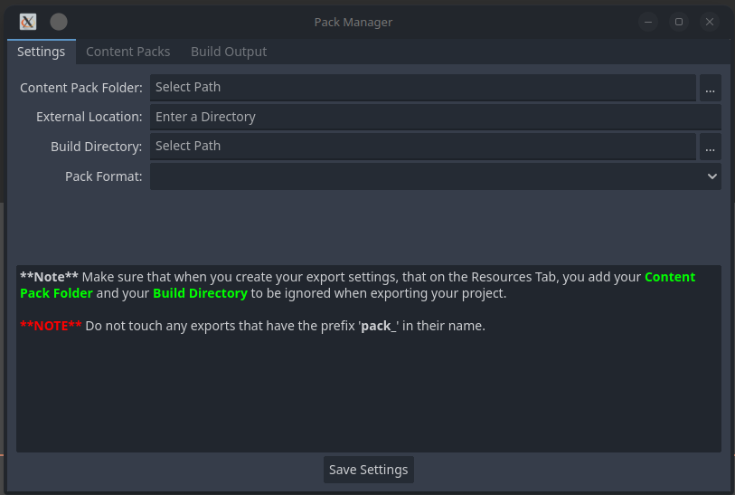
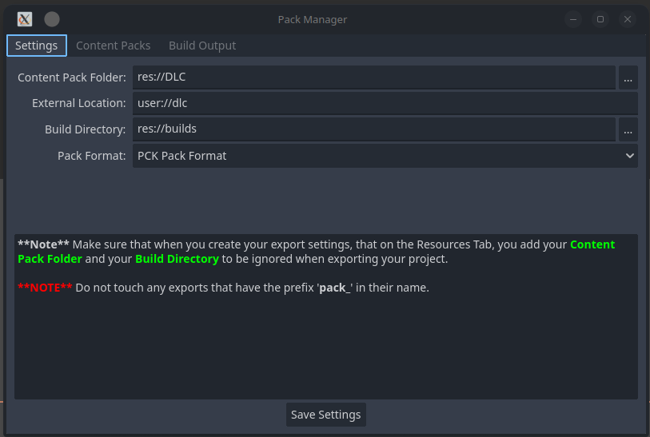
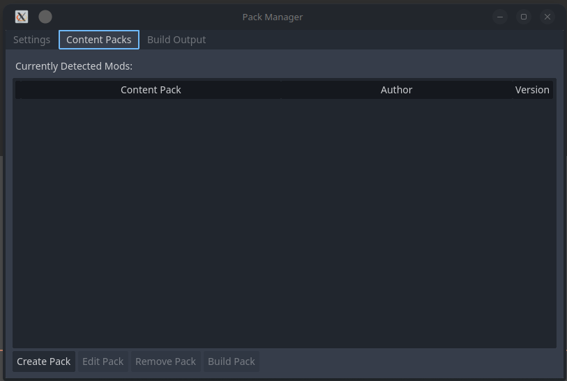
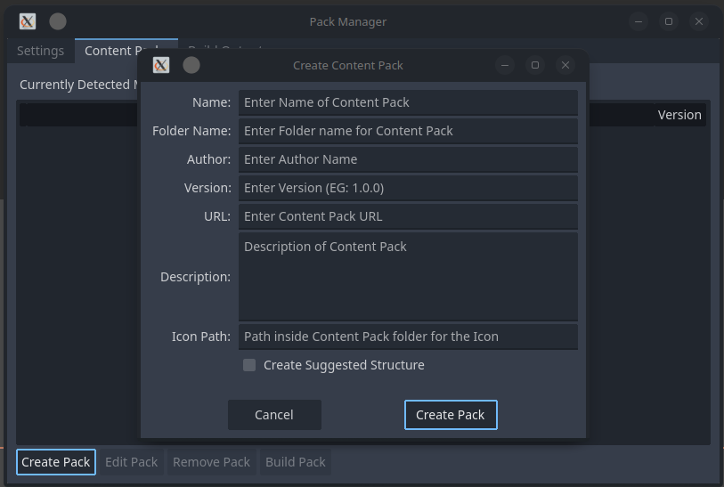
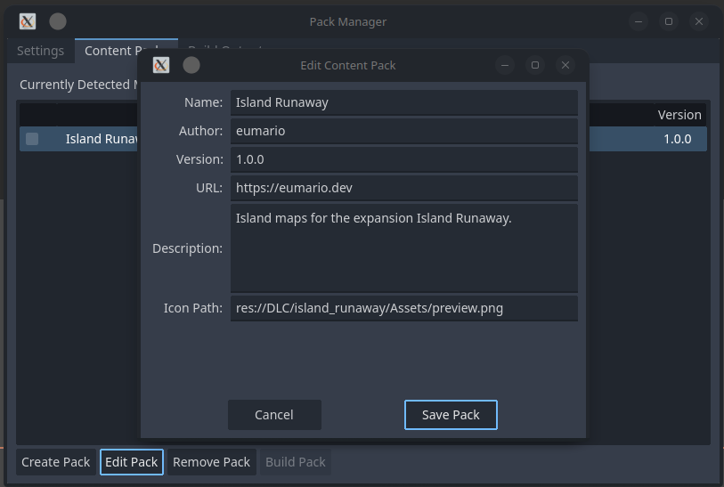
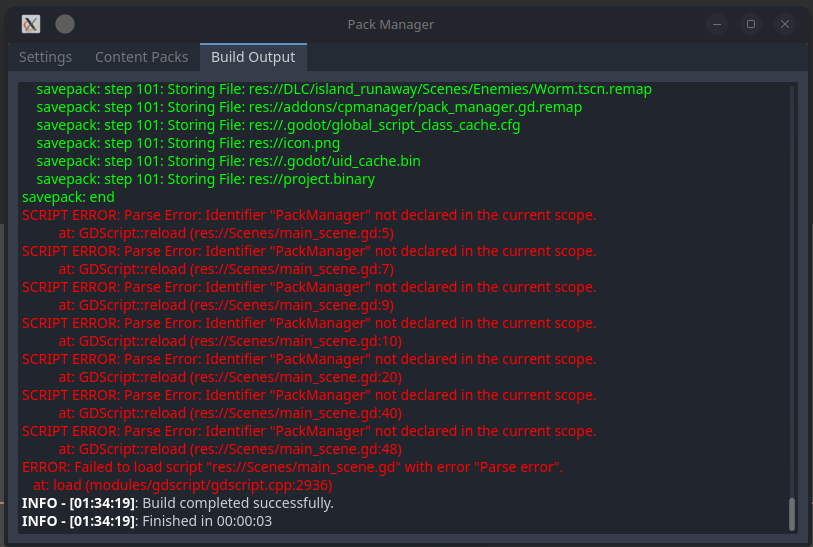

# Content Pack Manager


An addon for Godot, allowing the creation of extra content for a game, in the form of:
- DLC
- Addons/Plugins
- Sandboxed Mods

Current Godot documentation currently doesn't provide to much of an step by step way in which to create
extra content for your game, in form of tutorials.  Or gives you an idea of where to start from.  It's
mainly cause it is designed to be built in any way that you want.  Without understanding how to do this
process in Godot, it can be hard to properly get started with creating extra downloadable content.  Because
of this, I started this addon to be a way to give people an easier way in which to handle extra content.

> [!CAUTION]
> This framework is currently meant to be used as a Sandbox Mod / DLC / Addon/Plugin development framework
> as when it loads the pack, it does not overwrite what has been exported in your project.  So keep this in
> mind when working with development and design.

## Getting Started (UI)

Once you have obtained the Addon either through the Asset Library, or from releases here on github, you can
extract it out into your project's addons folder, and enable it in Project Settings.  Once it is enable,
you will have a New Link under **Project > Tools > Content Pack Manager**.

Upon first launch in a new Project, the Settings tab will be visible where you can configure your setup for
your project for first time run.



### Fields:

- **Content Pack Folder:**  This is the location where your extra content will reside, when building the packs.
- **External Location:**  This is where on the End-User's computer, the PackManager will look for content packs.
- **Build Directory:**  This is where the packs will be placed, after building has been completed.
- **Pack Format:**  This is the format in which to build your packs for your game, either in PCK, or ZIP format.

> [!WARNING]
> There is currently no way to mix between both ZIP format, and PCK Format.  Only 1 pack format is supported
> at a time.

> [!CAUTION]
> Zip format, is a clear packaging format, that can be opened in any Zip program for viewing, and extraction,
> where the PCK format is Godot's own packaging format.  While there aren't many programs out there to extract
> and view the files in this pack, there are tools to do it.  Also note, that Content Packs are not encrypted,
> so keep this in mind.



Once you have entered your information, take note of the text below the fields as there is important information
provided in there.  Once you have finished, click Save Settings, and you will be taken to the Content Packs listing.

## Content Packs



This is where you will manage the packs for your project.  At the bottom of the window, you will have buttons
to create, edit, remove, and build packs.  To start, you will create a new pack by pressing the Create Pack
button.  For each Pack that you want to do, you will create a new pack, and enter details into the new pack
dialog.



### Fields:

- **Name:** Name of Content Pack
- **Folder Name:** Name of folder that will be stored in the Conten Pack Folder.
- **Author:** Name of the person creating the content pack
- **Version:** Version of the Content Pack
- **URL:** URL page for the content pack
- **Description:** Descripton of the Content Pack
- **Icon Path:** Path to Icon / Artwork for pack.  This would be a relative path to the Content Pack folder.
- **Create Suggested Structure:** Creates a suggested folder structure for the pack.

Once all information is entered, CPM will create the base folder structure for the content pack.  If you
check Create Suggested Structure, it will create Additional folders for Assets, Scenes and Scripts,
otherwise, CPM will only create the pack_config.tres and pack_script.gd.



### Fields:

- **Name:** Name of Content Pack
- **Author:** Name of the person creating the content pack
- **Version:** Version of the Content Pack
- **URL:** URL Page for the Content Pack
- **Description:** Description of the Content Pack
- **Icon Path:** Path to the Icon / Artwork for the Content Pack

This will often be used to update / increment the version of the Content Pack, but you can update any
field provided.



When you want to build one or more of the Content Packs, check the box(es) next to each pack you wish
to build, and press Build Pack to build the Content Pack.

# Coding with Content Pack Manager

## pack_script.gd - Content Pack Entry Point

The pack_script.gd file is the main entry point into the content pack for setting everything up to be
used in the project.  Virtual functions are provided for you to override and set things up how you want
it to be.  To be as minimal as possible, while offering what is needed to ensure things are properly
initialized for your pack, so that it isn't in your way.

### Virtual Methods:
- **_setup():** This function is called, to setup everything needed inside your pack to be ready to go.
- **_configure(data : Variant):** This function is provided as a way to provide the data needed to initalize your content pack.  Any data can be passed to this method.
- **_enable_pack():** Allows you to establish what is needed to have your Content Pack ready to run.
- **_disable_pack():** Allows you to free up things, that are not needed when the your Content Pack is disabled.
- **_is_enabled():** Let's the pack tell the game if it is enabled or not.

## PackManager

The PackManager node, is an Autoload node, that is loaded at the startup of your project, and handles
scanning for, and loading of all packs into the file structure.  The manager is your main entry point
into Content Packs, allowing you to execute the various commands on all or specific content packs.  The
order in which you execute them is entirely up to you, but a suggested method would be to configure the
packs with your specific API's that you want your packs to have access to, then use setup() to initialize
any functionality that is needed, when you enable/disable packs.

### Methods:
- ### Applies to All Packs
  - **configure_packs(data : Variant):** Configure your packs with any data you want.  Can be a single Object / node, or an Array or Dictionary providing all information needed.
  - **setup_packs():** Executes setup() for each pack that is loaded, allowing for setup to be completed for each pack.
  - **enable_all_packs():** Executes enable for all packs that are loaded at runtime.
  - **disable_all_packs():** Executes disable for all packs that are loaded at run time.
- ### Applies to specific Packs
  - **configure_pack(pack : String, data : Variant):** Same as configure_packs(), but is only executed on the pack of the specified name.
  - **setup_pack(pack : String):** Executes setup() for the specific pack that is loaded, allowing setup to be completed for said pack.
  - **enable_pack(pack : String):** Executes enable_pack() for the specific pack.
  - **disable_pack(pack : String):** Executes disable_pack() for the specific pack.
  - **is_pack_enabled(pack : String):** Executes is_enabled() for the specific pack.
- ### Generic methods:
  - **get_pack_names():** Returns a list of found pack name strings when loading all packs.
  - **get_pack_config(pack : String):** Return the pack's Configuration (CPConfig), which holds the meta data for the pack.
  - **get_pack_path(pack : String):** Returns the internal path to the pack's data, EG: res://dlc/my_dlc_pack/
  - **scan_for_new():** Scans for new Packs that haven't been loaded at runtime, returning the number of packs found, if any.

# Example

Setting up package manager is a bit of an interesting run through.  As the API is pretty loose, and nothing is specifically
required, it is up to you how you implement your interface to loading packs.  You may not need to use enable/disable
for your pack, so you can ommit it.  Or you may want to only allow 1 pack to be loaded at a time, which can use the
enable/disable procedure.  In any case, a simple DLC example is what we will use to show how it works.

In this example, we will have a management node Called LevelManager, and a management node called MapManager.  And we want
our pack to be able to register new levels, and new maps for the user to be able to "travel" to.  So we will use the CPM
syetm in this way.  To start, we will setup a script to handle registering Packs using the PackManager script inside our
project.

## Game Setup
```gdscript
extends Node
var level_manager : Node
var map_manager : Node

func _ready():
  level_manager = get_tree().root.get_node("LevelManager")
  map_manager = get_tree().root.get_node("MapManager")

  PackManager.configure_packs({"lm": level_manager, "mm": map_manager})
  PackManager.setup_packs()
```

## PackScript setup
```gdscript
extends PackScript

var levels : Array[PackedScene] = [
  load(pack_path.join("Scenes/level_01.tscn")),
  load(pack_path.join("Scenes/level_02.tscn")),
  load(pack_path.join("Scenes/level_03.tscn"))
]

var maps : Array[Texture2D] = [
  load(pack_path.join("Assets/map_01.png")),
  load(pack_path.join("Assets/map_02.png")),
  load(pack_path.join("Assets/map_03.png"))
]

var level_manager : Node
var map_manager : Node

func _configure(data : Variant) -> void:
  level_manager = data.lm
  map_manager = data.mm

func _setup() -> void:
  for level in levels:
    level_manager.register_level(level)
  
  for map in maps:
    map_manager.register_map(map)
```

As you can see above, we have code in our main project, that will pass along the instance of LevelManager and MapManager to
our packs, and inside our pack, we are registering the new Levels and Maps with these managers so that it will be available
to the game, when displaying, and instancing the scenes for our players to be able to play in the game.  As you can see there
isn't much to creating a content pack, and utilizing it with the rest of your already existing game.

> [!CAUTION]
> Currently, C# Projects are not supported by CPM, as there's an Assembly that needs to be loaded
> before the code can be used.  That will come in a later version.